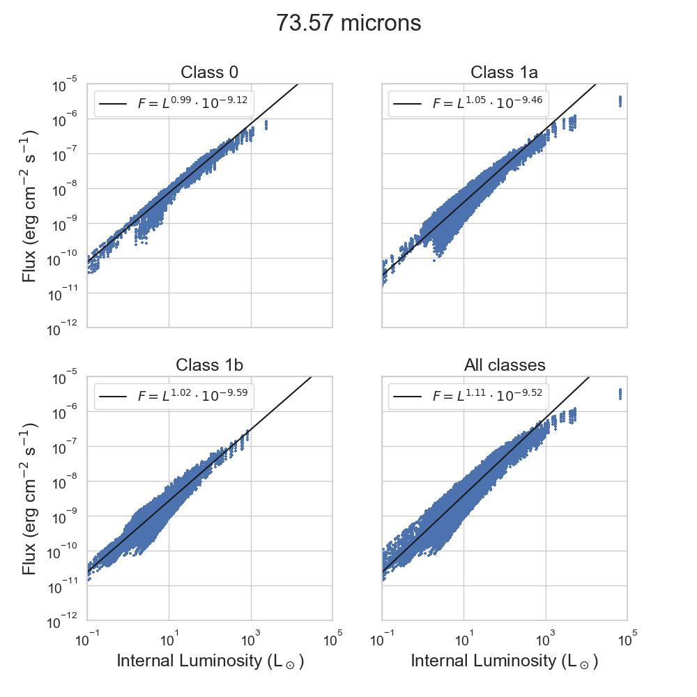
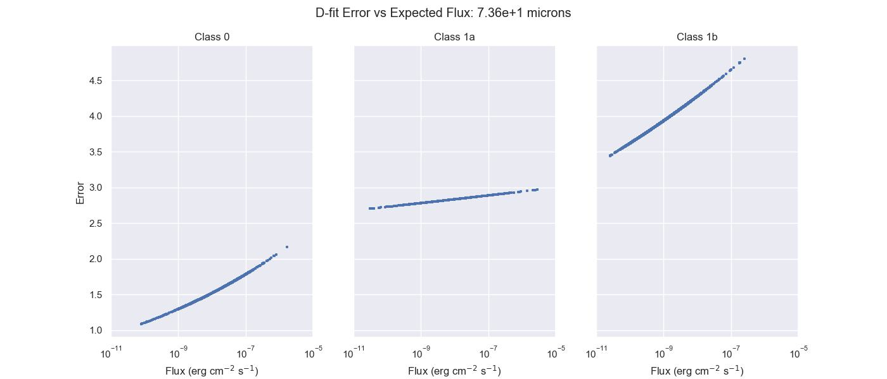
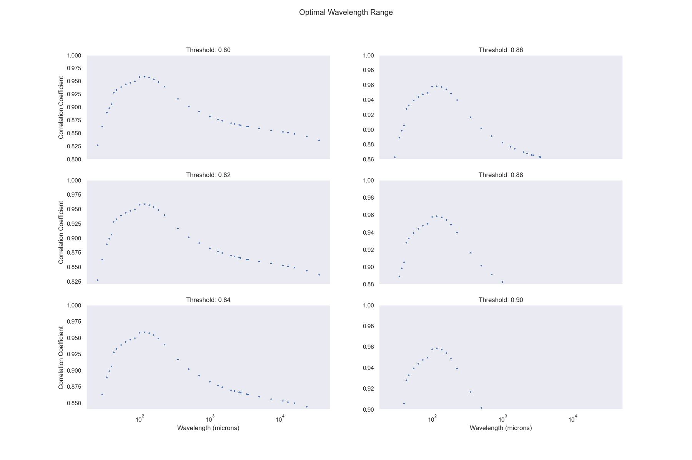

# Introduction

In section 3.2 of [Dunham _et. al._ (2008)](https://ui.adsabs.harvard.edu/abs/2008ApJS..179..249D/abstract), we obtained a crucial wavelength for measuring internal luminosity, $L_\text{int}$, of embedded, low-luminosity protostars, allowing astronomers to circumvent the traditional multi-wavelength observations typically required for studies of these objects. Specifically, Dunham _et. al._ discovered that the flux values at 70 microns, $F_{70}$, were tightly correlated with $L_\text{int}$ when simulating embedded, low-luminosity systems using radiative transfer models. A linear fit at that wavelength subsequently yielded coefficients of $m=1.06$ and $b=-9.02$.

However, the motivation behind this project stems from the observation that the correlation was only derived for protostars whose envelopes' variable masses were between 1-10 solar masses, implying that the study failed to consider protostars whose cores contained less than 1 solar mass. In other words, it was only tested for younger protostars whose mass distributions were still heavily centered around their surrounding envelopes (so-called class 0 objects). To add insult to injury, astronomers have been widely misusing the original 70 micron correlation by frequently applying it to non-class 0 protostars, and in doing so, implicitly introducing an error factor into their calculations that has gone largely unnoticed.

With that in mind, the goals of this project are threefold; by repeating the derivations performed by Dunham _et. al._, this time considerably extending our considerations, we aim to:
1. Determine if the original 70 micron correlation still holds for older protostellar systems (so-called class 1a and 1b objects).
2. Compute a correction factor for studies that misused the [Dunham _et. al._ (2008)](https://ui.adsabs.harvard.edu/abs/2008ApJS..179..249D/abstract) result.
3. Provide a suite of observing windows (in wavelength space) where $F$ and $L_\text{int}$ remain sufficiently correlated, rather than a singular entry point.

*_for clarity, we'll refer to the original fit as `dfit` (a.k.a. Dunham's fit), and the updated fit as `yfit` (a.k.a. Yek's fit)._

# Results
Upon inspection of the available data closest to 70 microns, we notice a strong positive correlation between $F$ and $L_\text{int}$ for class 0 targets. This is supported by a correlation coefficient of 0.98, and is consistent with the findings of [Dunham _et. al._ (2008)](https://ui.adsabs.harvard.edu/abs/2008ApJS..179..249D/abstract). 

Intriguingly, while slightly weaker for class 1a and 1b objects, this correlation appears to hold firm, yielding near identical correlation coefficients of 0.95. A combined analysis of the data at all 3 classes also yields a correlation coefficient of 0.95.

Next, we obtain an error factor by normalizing measured flux values provided by `dfit` against expected flux values from `yfit`, where the subsequent correction factor is simply the inverse of this number. Note, this factor is a function of $F$. 

We find that for class 0 objects, `dfit` overpredicts by roughly 1.0 - 2.2; for class 1a objects, roughly 2.7 - 3.1; for class 1b objects, roughly 3.4 - 4.9.

Finally, viewing the correlation coefficients (computed in `log10` space) as a function of wavelength, we set a conservative threshold of 0.9, yielding an optimal wavelength range of $10^1$ - $10^2$ microns. 

In other words, any measurement of internal luminosity for embedded, low-luminosity targets can be performed within this range with a high-degree of confidence.

*_relevant analyses alongside detailed documentation can be found in `src/`; data available upon request_
