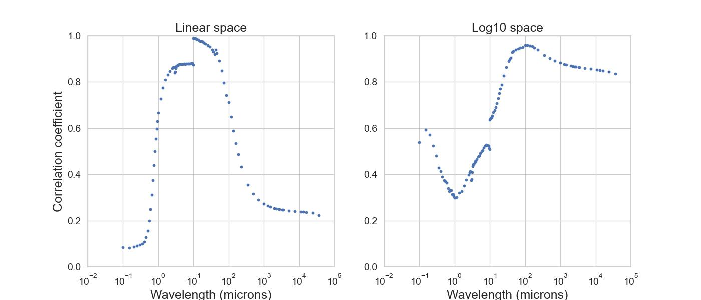

# Protostellar-Luminosity

Relevant analyses are in `src/`. Full project description coming soon

---

Q1: Does the fit still hold at class 1?

Answer: Yes, though the correlation degrades slightly (`correlation coefficient = 0.98` for class 0, `correlation coefficient = 0.95` for class 1). 

Q2: What range of wavelengths does the correlation hold for?

Answer: Between $10^0$ and $10^1$ microns.

Q3: How much error is introduced by using Dunham's '08 fit for non-class 0 data, w.r.t. my fits.

Answer: Dunham's fit overpredicts by a factor of `1 - 2` for class 0 objects, `2.5 - 3` for class 1a objects, and `3.5 - 5` for class 1b objects.

